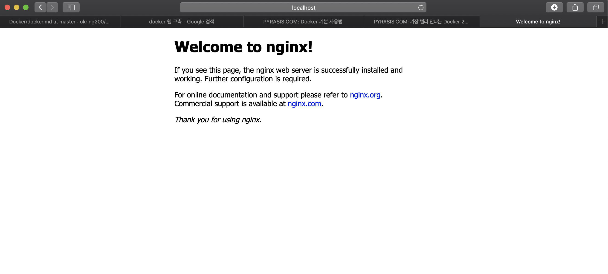

# DOCKER


## 1. Docker 란

컨테이너 기반의 오픈소스 가상화 플랫폼

**컨테이너** 

격리된 공간에서 프로세스가 동작하는 기술. 가상화 기술의 하나지만 기존방식과의 차이가 존재. 기존의 방법은 주로 os를 가상화. -> 프로세스를 격리하는 방식으로 바뀜

**이미지** 

컨테이너 실행에 필요한 파일과 설정값등을 포함. 상태값을 가지지 않고 변하지 않음. docker 이미지는 [Docker hub](https://hub.docker.com) 에 등록하거나 [Docker Registry](https://docs.docker.com/registry/) 저장소를 만들어 관리 가능.

## 2. Docker 설치

맥에서의 설치 방법: [docker 홈페이지](https://docs.docker.com) 에서 설치 가능

Docker 실행시 


메뉴바에 고래 모양이 나타나며, 실행 완료면 사라짐  <br/>

정상설치 되었는지 확인을 위한 명령어<br /> `docker version` 

아래와 같이 Client&Server 정보 출력되면 설치 완료

```
Client: Docker Engine - Community
 Version:           18.09.2
 API version:       1.39
 Go version:        go1.10.8
 Git commit:        6247962
 Built:             Sun Feb 10 04:12:39 2019
 OS/Arch:           darwin/amd64
 Experimental:      false

Server: Docker Engine - Community
 Engine:
  Version:          18.09.2
  API version:      1.39 (minimum version 1.12)
  Go version:       go1.10.6
  Git commit:       6247962
  Built:            Sun Feb 10 04:13:06 2019
  OS/Arch:          linux/amd64
  Experimental:     false
```

## 3. Docker 실행

docker를 실행하는 명령어는 다음과 같다.<br /> `docker run [OPTIONS] IMAGE[:TAG|@DIGEST] [COMMAND] [ARG..]`

### 3-1. Ubuntu 설치

 `docker run ubuntu:16.04`

`run` 명령어를 사용하면 사용할 이미지가 저장되어 있는지 확인하고 없다면 다운로드를 한 후 컨테이너를 생성하고 실행하게 됩니다.

```
Unable to find image 'ubuntu:16.04' locally
16.04: Pulling from library/ubuntu
34667c7e4631: Pull complete 
d18d76a881a4: Pull complete 
119c7358fbfc: Pull complete 
2aaf13f3eff0: Pull complete 
Digest: sha256:58d0da8bc2f434983c6ca4713b08be00ff5586eb5cdff47bcde4b2e88fd40f88
Status: Downloaded newer image for ubuntu:16.04
```

위 예제의 경우 우분투 이미지 저장 후 컨테이너를 정상적으로 실행하였습니다. 실행 후 명령어를 전달하지 않았기 때문에 자동으로 컨테이너 생성 직후 종료됩니다.

`bin/bash` 명령어를 통해 컨테이너를 실행해 보겠습니다.

```
naminje-ui-MacBookPro:docker 10058$ docker run --rm -it ubuntu:16.04 /bin/bash
root@3a737fb9f0da:/# cat /etc/issue
Ubuntu 16.04.6 LTS \n \l

root@3a737fb9f0da:/# ls
bin   dev  home  lib64  mnt  proc  run   srv  tmp  var
boot  etc  lib   media  opt  root  sbin  sys  usr
```

컨테이너 내부에서 bash shell을 실행하고 커맨드 입력을 위해 `-it` 옵션을 주었고, 프로세스 종료 시 자동 컨테이너 삭제를 위한 `--rm` 옵션을 주었습니다.

### 3-2. Redis 설치

redis는 메모리 기반 key/value store입니다.

```
naminje-ui-MacBookPro:docker 10058$ telnet localhost 1234
Trying ::1...
Connected to localhost.
Escape character is '^]'.
set mykey hello
+OK
get mykey
$5
hello
```

`-d` 옵션을 주어 컨테이너를 백그라운드 모드로 실행, `-p` 옵션을 통하여 호스트의 `1234포트` 를 컨테이너의 `6789포트` 로 연결합니다. 호스트 포트만 다르게 하면 하나의 서버에 여러개의 redis 서버를 띄울수 있습니다.

<details>
  <summary> Telnet Install for Mac</summary></br>
  <code>
    /usr/bin/ruby -e "$(curl -fsSL https://raw.githubusercontent.com/Homebrew/install/master/install)" </code></br>
  위의 명령어를 이용하여 brew 다운로드합니다.</br>
	<code>brew tap theeternalsw0rd/telnet</code></br>
	<code>brew install telnet</code></br>
	위 명령어를 이용하여 telnet 설치를 완료합니다.</br></br>
  *<code>/usr/local/share/man/man7 is not writable.</code>오류 시</br>
  <code>sudo chown -R $(whoami) /usr/local</code> 명령어를 이용하여 해결
</details>

## 4. Docker 기본 명령어

### 4-1. search

docker 허브에서 이미지를 검색합니다.<br/> `docker search <image_name>`

### 4-2. pull

`docker pull <image name>:<tag>` <br/> 이미지를 다운 받습니다. tag에 lastest를 입력하면 최신 버전을 받고, ubuntu:14.04처럼 태그를 지정해 줄 수 있습니다.

### 4-3. images

`docker images` <br/> 모든 이미지 목록을 출력합니다. `docker images ubuntu`처럼 이미지 이름을 설정하면 이름이 같고 태그가 다른 이미지들이 출력됩니다.

### 4-4. run

`docker run <option> <image name> <command> ` <br /> 이미지를 컨테이너로 생성한 뒤 command를 실행합니다. image 이름 대신 image id 도 사용가능 합니다.

<details>
  <summary>Option 정리</summary>
  -a, --attach=[]: 컨테이너에 표준 입력(stdin), 표준 출력(stdout), 표준 에러(stderr)를 연결합니다.<br>
--attach=”stdin”<br>
--add-host=[]: 컨테이너의 /etc/hosts에 호스트 이름과 IP 주소를 추가합니다.<br>
--add-host=hello:192.168.0.10<br>
-c, --cpu-shares=0: CPU 자원 분배 설정입니다. 설정의 기본 값은 1024이며 각 값은 상대적으로 적용됩니다.<br>
--cpu-shares=2048처럼 설정하면 기본 값 보다 두 배 많은 CPU 자원을 할당합니다.<br>
이 설정 값은 리눅스 커널의 cgroups에서 사용됩니다.<br>
--cap-add=[]: 컨테이너에서 cgroups의 특정 Capability를 사용합니다. ALL을 지정하면 모든 Capability를 사용합니다.<br>
--cap-add=”MKNOD” --cap-add=”NET_ADMIN”처럼 설정합니다. 모든 Capability 목록은 다음 링크를 참조하기 바랍니다.<br>
<a href="http://linux.die.net/man/7/capabilities">http://linux.die.net/man/7/capabilities</a><br>
--cap-drop=[]: 컨테이너에서 cgroups의 특정 Capability를 제외합니다.<br>
--cidfile=””: cid 파일 경로를 설정합니다. cid 파일에는 생성된 컨테이너의 ID가 저장됩니다.<br>
--cpuset=””: 멀티코어 CPU에서 컨테이너가 실행될 코어를 설정합니다.<br>
--cpuset=”0,1”처럼 설정하면 첫 번째, 두 번째 CPU 코어를 사용합니다.<br>
--cpuset=”0-3”처럼 설정하면 첫 번째 CPU 코어부터 네 번째까지 사용합니다.<br>
-d, --detach=false: Detached 모드입니다. 보통 데몬 모드라고 부르며 컨테이너가 백그라운드로 실행됩니다.<br>
--device=[]: 호스트의 장치를 컨테이너에서 사용할 수 있도록 연결합니다. <호스트 장치>:<컨테이너 장치> 형식입니다.<br>
--device=”/dev/sda1:/dev/sda1”처럼 설정하면 호스트의 /dev/sda1 블록 장치를 컨테이너에서도 사용할 수 있습니다.<br>
--dns=[]: 컨테이너에서 사용할 DNS 서버를 설정합니다.<br>
--dns=”8.8.8.8”<br>
--dns-search=[]: 컨테이너에서 사용할 DNS 검색 도메인을 설정합니다.<br>
--dns-search=”example.com”처럼 설정하면 DNS 서버에 hello를 질의할 때 hello.example.com을 먼저를 찾습니다.<br>
-e, --env=[]: 컨테이너에 환경 변수를 설정합니다. 보통 설정 값이나 비밀번호를 전달할 때 사용합니다.<br>
-e MYSQL_ROOT_PASSWORD=examplepassword<br>
--entrypoint=””: Dockerfile의 ENTRYPOINT 설정을 무시하고 강제로 다른 값을 설정합니다.<br>
--entrypoint=”/bin/bash”<br>
--env-file=[]: 컨테이너에 환경 변수가 설정된 파일을 적용합니다.<br>
--env-file=”/etc/environment”<br>
--expose=[]: 컨테이너의 포트를 호스트와 연결만 하고 외부에는 노출하지 않습니다.<br>
--expose=”3306”<br>
-h, --hostname=””: 컨테이너의 호스트 이름을 설정합니다.<br>
-i, --interactive=false: 표준 입력(stdin)을 활성화하며 컨테이너와 연결(attach)되어 있지 않더라도 표준 입력을 유지합니다. 보통 이 옵션을 사용하여 Bash에 명령을 입력합니다.<br>
--link=[]: 컨테이너끼리 연결합니다. <컨테이너 이름>:<별칭> 형식입니다.<br>
--link=”db:db”<br>
--lxc-conf=[]: LXC 드라이버를 사용한다면 LXC 옵션을 설정할 수 있습니다.<br>
--lxc-conf=”lxc.cgroup.cpuset.cpus = 0,1”<br>
-m, --memory=””: 메모리 한계를 설정합니다. <숫자><단위> 형식이며 단위는 b, k, m, g를 사용할 수 있습니다.<br>
--memory=”100000b”<br>
--memory=”1000k”<br>
--memory=”128m”<br>
--memory=”1g”<br>
--name=””: 컨테이너에 이름을 설정합니다.<br>
--net=”bridge”: 컨테이너의 네트워크 모드를 설정합니다.<br>
bridge: Docker 네트워크 브리지에 새 네트워크를 생성합니다.<br>
none: 네트워크를 사용하지 않습니다.<br>
container:<컨테이너 이름, ID>: 다른 컨테이너의 네트워크를 함께 사용합니다.<br>
host: 컨테이너 안에서 호스트의 네트워크를 그대로 사용합니다. 호스트 네트워크를 사용하면 D-Bus를 통하여 호스트의 모든 시스템 서비스에 접근할 수 있으므로 보안에 취약해집니다.<br>
-P, --publish-all=false: 호스트에 연결된 컨테이너의 모든 포트를 외부에 노출합니다.<br>
-p, --publish=[]: 호스트에 연결된 컨테이너의 특정 포트를 외부에 노출합니다. 보통 웹 서버의 포트를 노출할 때 주로 사용합니다.<br>
<호스트 포트>:<컨테이너 포트> 예) -p 80:80<br>
<IP 주소>:<호스트 포트>:<컨테이너 포트> 호스트에 네트워크 인터페이스가 여러 개이거나 IP 주소가 여러 개 일 때 사용합니다. 예) -p 192.168.0.10:80:80<br>
<IP 주소>::<컨테이너 포트> 호스트 포트를 설정하지 않으면 호스트의 포트 번호가 무작위로 설정됩니다. 예) -p 192.168.0.10::80<br>
<컨테이너 포트> 컨테이너 포트만 설정하면 호스트의 포트 번호가 무작위로 설정됩니다. 예) -p 80<br>
--privileged=false: 컨테이너 안에서 호스트의 리눅스 커널 기능(Capability)을 모두 사용합니다.<br>
--restart=””: 컨테이너 안의 프로세스 종료 시 재시작 정책을 설정합니다.<br>
no: 프로세스가 종료되더라도 컨테이너를 재시작하지 않습니다. 예) --restart=”no”<br>
on-failure: 프로세스의 Exit Code가 0이 아닐 때만 재시작합니다. 재시도 횟수를 지정할 수 있습니다. 횟수를 지정하지 않으면 계속 재시작합니다. 예) --restart=”on-failure:10”<br>
always: 프로세스의 Exit Code와 상관없이 재시작합니다. 예) --restart=”always”<br>
--rm=false: 컨테이너 안의 프로세스가 종료되면 컨테이너를 자동으로 삭제합니다. -d 옵션과 함께 사용할 수 없습니다.<br>
--security-opt=[]: SELinux, AppArmor 옵션을 설정합니다.<br>
--security-opt=”label:level:TopSecret”<br>
--sig-proxy=true: 모든 시그널을 프로세스에 전달합니다(TTY 모드가 아닐 때도). 단 SIGCHLD, SIGKILL, SIGSTOP 시그널은 전달하지 않습니다.<br>
-t, --tty=false: TTY 모드(pseudo-TTY)를 사용합니다. Bash를 사용하려면 이 옵션을 설정해야 합니다. 이 옵션을 설정하지 않으면 명령을 입력할 수는 있지만 셸이 표시되지 않습니다.<br>
-u, --user=””: 컨테이너가 실행될 리눅스 사용자 계정 이름 또는 UID를 설정합니다.<br>
-v, --volume=[]: 데이터 볼륨을 설정입니다. 호스트와 공유할 디렉터리를 설정하여 파일을 컨테이너에 저장하지 않고 호스트에 바로 저장합니다. 호스트 디렉터리 뒤에 :ro, :rw를 붙여서 읽기 쓰기 설정을 할 수 있으며 기본 값은 :rw입니다. 자세한 내용은 ‘6.4 Docker 데이터 볼륨 사용하기’를 참조하기 바랍니다.<br>
<컨테이너 디렉터리> 예) -v /data<br>
<호스트 디렉터리>:<컨테이너 디렉터리> 예) -v /data:/data<br>
<호스트 디렉터리>:<컨테이너 디렉터리>:<ro, rw> 예) -v /data:/data:ro<br>
<호스트 파일>:<컨테이너 파일> 예) -v /var/run/docker.sock:/var/run/docker.sock--vol<br>
 umes-from=[]: 데이터 볼륨 컨테이너를 연결하며 <컨테이너 이름, ID>:<ro, rw> 형식으로 설정합니다. 기본적으로 읽기 쓰기 설정은 -v 옵션의 설정을 따릅니다. 자세한 내용은 ‘6.5 Docker 데이터 볼륨 컨테이너 사용하기’를 참조하기 바랍니다.<br>
--volumes-from=”hello”<br>
--volumes-from=”hello:ro”처럼 설정하면 데이터 볼륨을 읽기 전용으로 사용합니다.<br>
--volumes-from=”hello:rw”처럼 설정하면 데이터 볼륨에 읽기 쓰기 모두 할 수 있습니다.<br>
-w, --workdir=””: 컨테이너 안의 프로세스가 실행될 디렉터리를 설정합니다.<br>
--workdir=”/var/www”<br>
</details>

### 4-5. ps

아래 명령을 이용하여 모든 컨테이너 목록 출력합니다.<br /> `docker ps <option>`

`-a` 옵션을 이용하면 정지된 컨테이너까지 모두 출력합니다.

### 4-6. start

`docker start <container name | container id>` <br /> 컨테이너 실행을 시작합니다.

`restart` 명령어를 이용하여 재시작할 수 있습니다.

###4-7. Attach

## 5. Cowsay 예제

### 5-1. Cowsay 설치 및 실행

`docker run -it --name cowsay --hostname cowsay debian bash` <br /> Cowsay 컨테이너를 실행합니다.

`apt-get update` & `apt-get install -y cowsay fortune` <br/> 위의 두 명령어를 이용하여 패키지들을 설치합니다.

`/usr/games/fortune | /usr/games/cowsay` 응용프로그램을 시작합니다.<br/> 컨테이너를 이미지로 바꾸려면 `docker commit` 명령어를 이용하면 됩니다. 이 명령어는 컨테이너 상태에 상관 없이 동작합니다.<br/> `docker commit <컨테이너이름> <이미지 저장소/이미지 이름>` 을 명시해 주어야 합니다.

```
dnaminje-ui-MacBookPro:Docker 10058$ docker commit cowsay test/cowsayimage
sha256:fa5fdcba6cf9f23141eb55a4f8b1285a2a63f29a60c6251cb640fb9f5ffbe844
```

위와 같이 이미지를 구분할 수 있는 ID가 반환됩니다. 이제 이 이미지를 실행할 수 있습니다.<br/> `docker run test/cowsayimage /usr/games/cowsay "MOO"`

하지만 위와 같이 기본이미지를 사용하려면 처음부터 모든 작업을 다시 시작해야합니다. 이런 문제를 해결 하려면  도커파일을 이용하여 이미지 생성을 자동화하는 것입니다.

### 5-2. Cowsay 도커파일로 이미지 만들기

```
mkdir cowsay
cd cowsay
touch Dockerfile
```

위 명령어를 이용하여 dockerfile을 생성합니다.<br/> 다음 내용을 dockerfile에 추가합니다.

```
From debian
RUN apt-get update && apt-get install -y fortune
```

`docker build -t test/cowsay-dockerfile .` 을 이용하여 이미지를 생성합니다.

`docker run test/cowsay-dockerfile /usr/games/cowsay "MOO"` <br/> 위의 명령어를 이용하여 이미지를 실행시킬 수 있습니다.

### 5-3. EntryPoint

Entrypoint 설정은 docker run명령으로 전달되는 인자처리를 하기위한 실행 파일을 명시할 수 있도록 해줍니다.

다음의 줄을 docker file 하단에 추가합니다.<br/> `ENTRYPOINT ["/usr/games/cowsay"]` 

이미지를 다시 빌드하고 실행하면 cowsay 명령없이 이미지를 실행할 수 있습니다.

```
docker build -t test/cowsay-dockerfile
docker run test/cowsay-dockerfile "Moo"
```

## 6. NGINX - MongoDB 예제

### 6.1 nginx 이미지파일 생성 및 실행

```
mkdir nginxEx
cd nginxEx
```

폴더로 이동 후 dockerfile을 생성하여줍니다

```
FROM ubuntu:16.04
MAINTAINER okring200 <okring200@gmail.com>

RUN apt-get update
RUN apt-get install -y nginx
RUN echo "\ndaemon off;" >> /etc/nginx/nginx.conf
RUN chown -R www-data:www-data /var/lib/nginx

## host와 공유할 directory 목록
VOLUME ["/data", "/etc/nginx/site-enabled", "/var/log/nginx"]

#CMD에서 설정한 실행파일이 실행될 directory
WORKDIR /etc/nginx

#컨테이너 시작시 실행될 파일
CMD ["nginx"]

#호스트와 연결될 포트 번호
EXPOSE  80
EXPOSE 443
```

Dockerfile을 작성하였으면 해당 이미지를 생성합니다. 파일이 저장되 있는 경로에서 아래의 명령어를 실행합니다.<br/> `docker build --tag hello:0.1 .` <br/> docker build <option> <Dockerfile 경로> 형식입니다. tag 옵션으로 이미지 이름과 태그를 설정할 수 있습니다. 

docker를 실행해 봅니다.

`docker run --name hello-nginx -d -p 80:80 -v /Users/10058/minje/docker/nginxEx/docker/data/:/data hello:0.1` <br/> `-v` 옵션을 이용하여 호스트의 directory를 컨테이너의  **/data** directory에 연결합니다. host directory에 파일을 넣으면 컨테이너에서 해당 파일을 읽을 수 있습니다.

```
naminje-ui-MacBookPro:nginxEx 10058$ docker ps
CONTAINER ID        IMAGE               COMMAND             CREATED             STATUS              PORTS                         NAMES
0ae1b2918c39        hello:0.1           "nginx"             12 minutes ago      Up 12 minutes       0.0.0.0:80->80/tcp, 443/tcp   hello-nginx
```

hello-nginx 컨테이너가 실행되었습니다. 

웹 브라우저를 실행하여, `http://localhost:80` 접속하면 아래와 같은 화면이 표시됩니다.



### 6-2. 컨테이너 연결

mongoDB를 컨테이너로 올려 웹서버와 연결시켜봅니다.<br/>먼저 db 이미지를 컨테이너로 실행합니다.

`docker run --name db -d mongo` 

웹 컨테이너를 생성하면서 db 컨테이너와 연결합니다.웹서버 컨테이너는 nignx를 사용하겠습니다.

`docker run --name web -d -p 80:80 --link db:db nginx` <br/>

`docker inspect` 명령어를 통하여 hostpath를 확인 후 내용을 살펴봅니다.

`"HostsPath":"/var/lib/docker/containers/3656b6aaf32875d9b8c02afde101268b7dfa6f7014d720ec659cdd25b84a525b/hosts"` <br/>**mac 에서는 path가 다르다.** mac은 docker의 실제 호스트가 아니다. Mac 용 docker는 가상의 머신을 실행하기 때문에 /var/lib/docker/container에 존재하지 않는다.

`screen ~/Library/containers/com.docker.docker/Data/vms/0/tty` <br/>위의 명령어를 입력하게 되면 빈 화면이 나오는데 거기에 <br/>`cat /var/lib/docker/containers/<hostpath>/hosts` <br/>을 실행하여 세부 정보를 볼 수 있습니다.

`172.17.0.2      db e0cc729108c2` <br/>db는 `—link db:db` 에서 설정한 별칭이고 뒤에 e0cc729108c2는 container id를 나타냅니다. 앞의 주소는 db 컨테이너의 주소이며 별칭을 통해 연결한 컨테이너에 접속할 수 있습니다.

